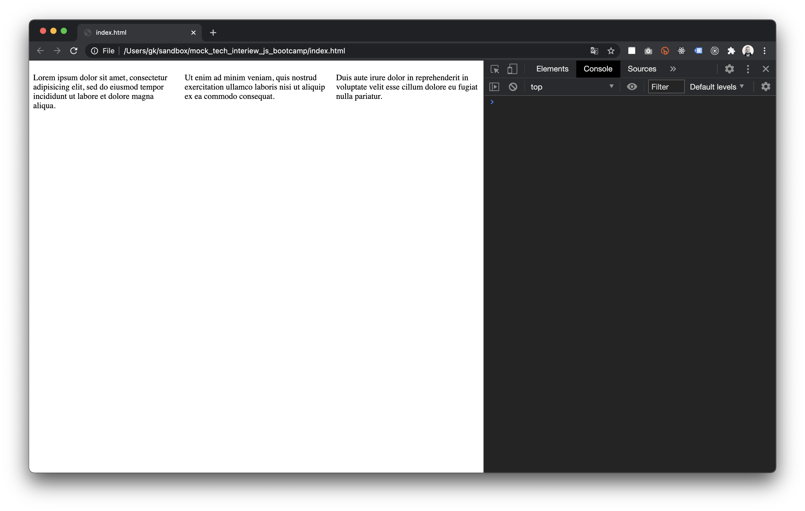
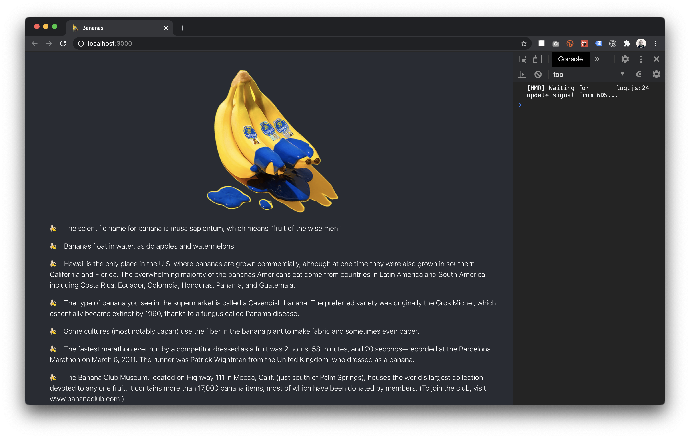

# HTML

## 01. What is the difference (if any) between `div` and `span` elements? / < 5 minutes

div A block-level element always starts on a new line and takes up the
full width available (stretches out to the left and right as far as it
can).

span An inline element does not start on a new line and only takes up as
much width as necessary.

## 02. What is the difference (if any) between `div` and `section` elements? / < 5 minutes

The <section> tag defines sections in a document, such as chapters, headers, footers, or any other sections of the document means is a large scale idea of what content on the page is.

The div element has no special meaning Div can be used for smaller things, such as a container for presentation, or where there is no semantic idea to be communicated.

## 03. What is the purpose of `head` element? / < 5 minutes

The <head> element is a container for metadata (data about data) and is placed between the <html> tag and the <body> tag.
Metadata is data about the HTML document. Metadata is not displayed.
Metadata typically define the document title, character set, styles, scripts, and other meta information.
The following elements can go inside the <head> element:

<title> (required in every HTML document)
<style>
<base>
<link>
<meta>
<script>
<noscript>

## 04. Is there anything wrong with this code? / < 5 minutes

If there is, please fix it and commit changes.

```html
<!DOCTYPE html>
<html>
  <head>
    <title>Mega lorem</title>
    <!-- <h1>Mega lorem</h1> -->
  </head>
  <body>
    <main>
      <section>
        <div>
          <h1>Lorem ipsum</h1>

          <p>
            Lorem ipsum dolor sit amet, consectetur adipisicing elit, sed do
            eiusmod
          </p>
          
          <p>Lorem ipsum dolor sit amet</p>
          <ul>
            <li>Lorem 1</li>
            <li>Lorem 2</li>
          </ul>
        </div>
      </section>
    </main>
  </body>
</html>
```

# CSS

## 01. How can we achieve these results with CSS for the following HTML code? If you know several ways please write all of them. / 5-10 minutes

```html
<article>
  <p>
    Lorem ipsum dolor sit amet, consectetur adipisicing elit, sed do eiusmod
    tempor incididunt ut labore et dolore magna aliqua.
  </p>
  <p>
    Ut enim ad minim veniam, quis nostrud exercitation ullamco laboris nisi ut
    aliquip ex ea commodo consequat.
  </p>
  <p>
    Duis aute irure dolor in reprehenderit in voluptate velit esse cillum dolore
    eu fugiat nulla pariatur.
  </p>
</article>
```



```css
article {
  display: flex;
  align-items: center;
}
P {
  margin-right: 5px;
}
```

## 02. You need to vertically center this text inside the gradient container. What would be your approach? / 5 minutes


```html
<article class="two">
  <p>I should be in the middle</p>
</article>
```

```css
article {
  height: 30vh;
  width: 100vw;
  background: linear-gradient(45deg, #f902db, aqua);
}

.two {
  display: flex;
  align-items: center;
  justify-content: center;
}
```

# JavaScript

## 01. Is it possible to rewrite this function so it will still give the same output but will not have `return` keyword in it? / 5 minutes

```js
function add(num1, num2) {
  return num1 + num2;
}

const add = (num1, num2) => num1 + num2;
```

## 02. Which ways do you know to make sure that this function is not returning NaN if one or both arguments are not provided but instead treats missing argument(s) as zeros? / 5 minutes

```js
function add(num1, num2) {
  if (num1 === undefined || num1 === null) {
    console.log('value provided is not a number.');
  }
  if (num2 === undefined || num2 === null) {
    console.log('value provided is not a number.');
  }
  return num1 + num2;
}
```

## 03. What would be the output of this function? Why? / 5 minutes

```js
let lookingForTwo = (a) => {
  return a.forEach((n) => (n === 2 ? 'ok' : 'not 2'));
};
lookingForTwo([1, 2, 3]);
```

The output of this function would be undefined.
The forEach method is used to execute a function on each element of an array, but it does not return a value. Instead, it modifies the array in place or performs some side effect.

## 04. If using `fetch` you have the following **products.json**, how would you print the total cost of these 3 products in the most efficient way / < 10 minutes

Find the json file in ./products.json

```js
/* The most efficient way to print the total cost of these 3 products would be to use the reduce() method */
fetch('products.json')
  .then((response) => response.json())
  .then((data) => {
    let totalCost = data.products.reduce(
      (acc, product) => acc + product.price,
      0,
    );
    console.log(totalCost);
  })
  .catch((error) => console.error('Error:', error));
```

# React

## 01. What are benefits of using react.js compared to plain html/css? / 5 minutes

By using React, you can build high-performance, scalable, and maintainable web applications that are easy to understand and develop.

Here are a few benefits of using React :

Component-based architecture: React allows you to build your user interface using small, reusable components. This makes it easier to manage your code and makes it more maintainable over time.

Virtual DOM: React uses a virtual DOM, which is a lightweight representation of the actual DOM. When a component's state changes, React updates the virtual DOM, and then uses a process called "reconciliation" to update the actual DOM only where necessary. This makes React's updates more efficient and fast, compared to manually manipulating the DOM with vanilla JavaScript.

Unidirectional data flow: React follows a unidirectional data flow architecture, which means that data flows in one direction, from parent components to child components. This makes it easier to trace and debug the flow of data in your application and helps to avoid unexpected behavior.

JSX: React uses JSX, a syntax extension for JavaScript, which allows you to write HTML-like elements in your JavaScript code. This makes it easier to understand the structure of your user interface and helps to keep your HTML, CSS and JavaScript code together in one place.

Reusability: React Components can be reused in multiple places, with the same or different data, this makes it easier to avoid duplicated code and make your application scalable.

## 02. What is state and how is it useful (if at all)? / 5 minutes

State is useful because it allows React components to keep track of the data they need in order to render and update their view, and to respond to events that occur within the component. With state, a component can change its view and behavior in response to user interactions or other events, without having to make a round trip to the server.

## 03. Fix all the possible errors/warnings in the code from the fix_react folder and publish it online in any way you prefer. / 15 minutes



# Backend

## 01. You have a bank account, your bank has a website where you can do all the operations with your accounts. You have decided to make a bank transfer to your friend's account. You take a laptop and about to do so. Please explain data flow in as much details as possible for this operation (assuming you bank is not using SMS confirmations or two-factor authentication) / 5 minutes

First, browser sends a request to bank's server for the website's HTML, CSS, and JavaScript files. These files are then rendered in your browser, allowing you to interact with the website's interface.
When you enter your login information, such as your username and password, and submit the form, the browser sends a request to the bank's server with that information.
The bank's server will then check the provided credentials against the records stored in their database, if the provided credentials match, the server will grant a session token, which will be stored on the browser and server-side, this token will be used to identify you in the following operations.
once logged in, will be directed to the bank transfer page. You will enter the details of the transfer The browser will then send a request to the bank's server with the transfer details. The bank's server will then check if you have sufficient funds in your account and if the recipient's account number is valid, if the check is passed, the server will then process the transfer.

## 02. Explain MVC / 5 minutes

MVC stands for Model-View-Controller. It is a design pattern that is commonly used in building user interfaces, particularly in web applications. The MVC pattern separates an application into three main components: the model, the view, and the controller.

The Model represents the data or the state of the application. It contains the data structures, methods, and business logic that handle the manipulation and management of the data. In a banking application, for example, the model would be the data representing the accounts, transactions, and other relevant data for the application.

The View represents the presentation layer of the application. It is responsible for displaying the data from the model to the user in a way that is visually appealing and easy to understand. In the banking application example, the view would be the HTML and CSS that makes up the user interface of the website.

The Controller acts as an intermediary between the model and the view. It receives user inputs, such as button clicks and form submissions, and then updates the model or the view accordingly. It also receives updates from the model, and updates the view. In the banking application, the controller would handle the logic that handles the request, validate it, and then update the model and view based on the request.

## 03. Create a server with only one route sending as a response current timestamp in a string like this / 5-10 minutes:

`Current time is Mon Jan 09 2023 13:26:25 GMT+0100 (Central European Standard Time)`
```js
const express = require('express');
const app = express();

app.get('/', (req, res) => {
  const currentTime = new Date().toString();
  res.send(`Current time is ${currentTime}`);
});

app.listen(3000, () => {
  console.log('Server listening on port 3000');
});
```